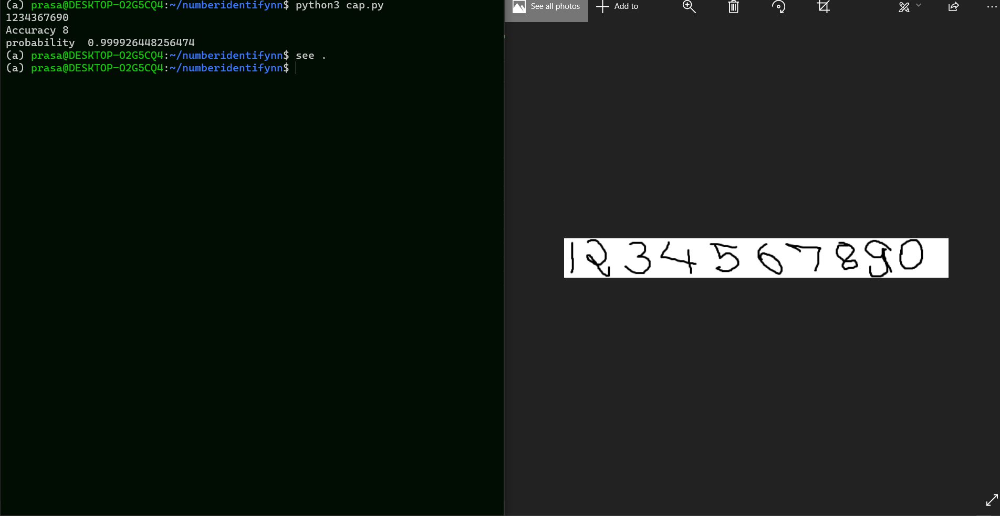

# NUMBER GENERATOR 

* An experimental alternative to something more end to end 
* Identify numbers from convo neural net

* The whole worflow can be seen as 
        -> Take input as a form of a local image 
        -> Run the image through a custom segmenter algorithm and process it for the model
        -> Use a simple model trained on MNIST to predict the numbers 

* Pros : 
    A very simple MNIST classifier 
    Small training time, plus predictions are faster 
* Cons : 
    classificaion accuracy is lesser
